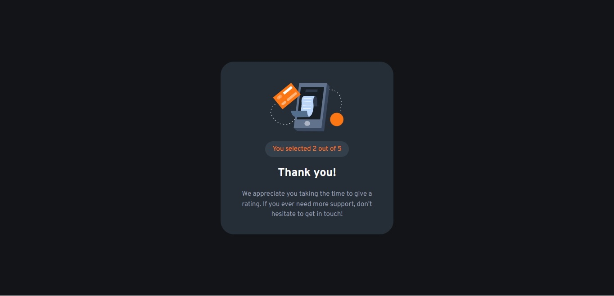

# Frontend Mentor - Interactive rating component solution

This is a solution to the [Interactive rating component challenge on Frontend Mentor](https://www.frontendmentor.io/challenges/interactive-rating-component-koxpeBUmI). Frontend Mentor challenges help you improve your coding skills by building realistic projects. 

## Table of contents

- [Overview](#overview)
  - [The challenge](#the-challenge)
  - [Screenshot](#screenshot)
  - [Links](#links)
- [My process](#my-process)
  - [Built with](#built-with)
  - [What I learned](#what-i-learned)
  - [Continued development](#continued-development)
  - [Useful resources](#useful-resources)
- [Author](#author)

## Overview

### The challenge

Users should be able to:

- View the optimal layout for the app depending on their device's screen size
- See hover states for all interactive elements on the page
- Select and submit a number rating
- See the "Thank you" card state after submitting a rating

### Screenshots




### Links

- Solution URL: [GitHub](https://github.com/lemartinezm/interactive-rating-component)
- Live Site URL: [Vercel](https://interactive-rating-component-nu.vercel.app/)

## My process

### Built with

- HTML
- SCSS
- [React](https://reactjs.org/) - JS library
- [Create React App](https://create-react-app.dev/)
- [TypeScript](https://www.typescriptlang.org/)

### What I learned

* Mixin and variables in SCSS:

```scss
$primary-color: hsl(25, 97%, 53%);

@mixin flex-row-center {
  display: flex;
  flex-direction: row;
  justify-content: center;
  align-items: center;
}
```

* Create project with create-react-app with TypeScript template
```
$ npx create-react-app interactive-rating-component --template typescript
```

### Continued development

* Styling with SCSS/SASS
* Conditional render in React
* Types in TypeScript

### Useful resources

- [Variables and Mixins](https://sass-lang.com/guide) - This helped me for SCSS.
- [Types](https://www.typescriptlang.org/docs/handbook/jsx.html) - This helped me for types definition in TypeScript.

## Author

- Frontend Mentor - [@lemartinezm](https://www.frontendmentor.io/profile/lemartinezm)
- Twitter - [@Luis14151617](https://twitter.com/Luis14151617)